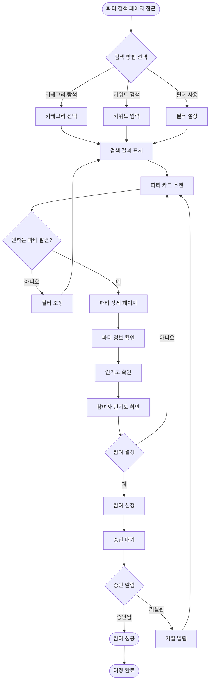
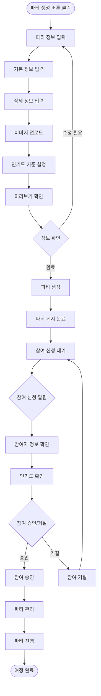
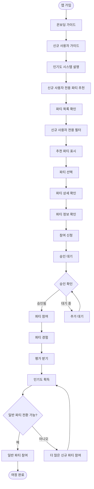

# UX Design Specification party

**Author:** Seodaun
**Date:** 2025-12-27

---

<!-- UX design content will be appended sequentially through collaborative workflow steps -->

## Executive Summary

### Project Vision

Party는 파티를 전문적으로 다루는 커뮤니티 플랫폼으로, 당근마켓과 같은 범용 플랫폼과 달리 파티에 특화된 기능과 인기도 기반 평가 시스템을 제공합니다. 핵심 목표는 신뢰할 수 있는 참여자들을 확보하고 클린한 파티 커뮤니티를 구축하는 것입니다. 웹 중심 플랫폼으로, 사용자들이 파티 전 단계에서 파티를 검색하고 계획하는 경험에 최적화되어 있습니다.

### Target Users

#### 1. 파티 주최자 (민수, 28세)
- **핵심 문제**: 신뢰할 수 있는 참여자 모집의 어려움
- **기술 친숙도**: 스마트폰 사용에 익숙
- **사용 패턴**: 파티 전 단계에서 참여자 모집 및 관리
- **주요 니즈**: 인기도 시스템을 통한 신뢰할 수 있는 참여자 필터링, 파티 관리 도구

#### 2. 파티 참여자 (지은, 25세)
- **핵심 문제**: 원하는 파티를 찾기 어려움
- **기술 친숙도**: 스마트폰 사용에 익숙
- **사용 패턴**: 파티 전 단계에서 원하는 파티 검색 및 참여 신청
- **주요 니즈**: 효율적인 파티 검색, 파티 및 참여자 신뢰도 확인

#### 3. 신규 사용자 (준호, 23세)
- **핵심 문제**: 진입 장벽
- **기술 친숙도**: 스마트폰 사용에 익숙
- **사용 패턴**: 파티 전 단계에서 첫 파티 찾기 및 참여
- **주요 니즈**: 부담 없는 첫 경험, 인기도 시스템 이해

### Key Design Challenges

#### 1. 신뢰 시각화 및 전달
- 인기도 시스템을 직관적이고 신뢰할 수 있게 표현해야 함
- 사용자가 신뢰도 정보를 빠르게 파악할 수 있어야 함
- 인기도가 낮은 사용자에게도 공정하게 보이도록 설계해야 함

#### 2. 파티 검색 및 발견 경험
- 다양한 필터(카테고리, 날짜, 지역, 인기도 등)를 쉽게 사용할 수 있어야 함
- 웹 중심이므로 데스크톱과 모바일 반응형 지원이 필수
- 사용자가 원하는 파티를 빠르게 찾을 수 있는 검색 경험 제공

#### 3. 파티 전 계획 중심 UX
- 파티 전 단계(검색, 신청, 준비)에 최적화된 경험 설계
- 파티 정보를 명확하고 충분히 제공하여 참여 결정을 돕는 정보 구조
- 참여 결정에 필요한 모든 정보를 쉽게 확인할 수 있어야 함

#### 4. 평가 시스템의 사용성
- 파티 후 평가를 간단하고 명확하게 작성할 수 있어야 함
- 평가 기준을 이해하기 쉽게 표현
- 평가 작성이 부담스럽지 않도록 설계

### Design Opportunities

#### 1. 인기도 시각화로 차별화
- 인기도를 직관적이고 신뢰할 수 있게 표현하여 당근마켓과 차별화
- 신뢰도 정보를 한눈에 파악할 수 있는 대시보드 및 시각화 요소
- 인기도 시스템의 투명성과 공정성을 시각적으로 강조

#### 2. 파티 전문성 강조
- 파티에 특화된 UI/UX 패턴으로 전문성 표현
- 파티 정보를 구조화하고 시각화하여 정보 전달력 향상
- 파티 커뮤니티만의 브랜드 경험과 일관성 있는 디자인 언어

#### 3. 웹 중심 반응형 디자인
- 데스크톱과 모바일 모두에서 최적화된 경험 제공
- 파티 전 계획에 적합한 정보 밀도와 레이아웃
- 빠른 로딩 속도와 부드러운 인터랙션으로 사용성 향상

#### 4. 신규 사용자 온보딩 (향후)
- 진입 장벽을 낮추는 온보딩 경험 설계
- 인기도 시스템을 쉽게 이해할 수 있는 가이드 및 튜토리얼
- 첫 경험을 긍정적으로 만드는 UX 패턴

---

## Core User Experience

### Defining Experience

Party의 핵심 사용자 경험은 파티 전 단계에서 사용자가 원하는 파티를 찾고, 신뢰할 수 있는 파티와 참여자를 확인하며, 참여를 결정하는 과정에 집중됩니다.

**핵심 사용자 액션:**

1. **파티 참여자 핵심 루프:**
   - 파티 검색 → 파티 상세 확인 (인기도 포함) → 참여 신청 → 평가 작성

2. **파티 주최자 핵심 루프:**
   - 파티 생성 → 참여자 모집 (인기도 기준 설정) → 파티 관리 → 평가 확인

**가장 중요한 핵심 액션:**
- 파티 참여자: 파티 검색 및 신뢰도 확인
- 파티 주최자: 파티 생성 및 참여자 모집

이 핵심 액션들이 완벽하게 작동하면, 나머지 기능들이 자연스럽게 따라옵니다.

**Defining Experience (제품을 정의하는 핵심 상호작용):**

Party의 핵심 경험은 두 가지 defining interaction으로 정의됩니다:

1. **파티 참여자: "인기도를 확인하고 신뢰할 수 있는 파티 찾기"**
   - 사용자가 친구에게 설명할 핵심 액션: "인기도를 보고 신뢰할 수 있는 파티를 찾아요"
   - 이 상호작용이 완벽하면 사용자가 플랫폼의 가치를 즉시 인식

2. **파티 주최자: "인기도 기준으로 신뢰할 수 있는 참여자 모집하기"**
   - 사용자가 친구에게 설명할 핵심 액션: "인기도 기준을 설정해서 좋은 참여자들만 모집해요"
   - 이 상호작용이 완벽하면 주최자가 플랫폼의 핵심 가치를 경험

### User Mental Model

**사용자의 기대와 Mental Model:**

#### 1. 파티 검색에 대한 기대
- **기존 경험**: 당근마켓과 유사하지만 파티에 특화된 검색 기대
- **Mental Model**: 카테고리 탐색 + 필터 조합으로 원하는 파티 발견
- **기대**: 검색 결과가 즉시 표시되고, 필터 변경이 실시간으로 반영됨

#### 2. 인기도 시스템에 대한 이해
- **새로운 개념**: 인기도 시스템은 새로운 개념이므로 명확한 설명과 시각화 필요
- **Mental Model**: Airbnb 스타일의 신뢰도 표시에 대한 기대
- **기대**: 인기도가 한눈에 이해되고, 신뢰할 수 있다고 느껴짐

#### 3. 신뢰 확인에 대한 기대
- **기존 경험**: Airbnb 스타일의 호스트/게스트 신뢰도 표시에 대한 기대
- **Mental Model**: 신뢰도 정보를 바탕으로 참여 결정
- **기대**: 신뢰도 정보가 명확하고 충분히 제공됨

**혼란스럽거나 좌절할 가능성이 있는 지점:**
- 인기도 시스템이 복잡해 보일 수 있음 → 명확한 시각화와 설명 필요
- 필터 조합이 어려울 수 있음 → 직관적인 필터 UI와 가이드 제공
- 인기도 계산 방식이 불명확할 수 있음 → 투명성 보장

**현재 솔루션(당근마켓)에서의 경험:**
- **좋아하는 점**: 간단한 검색, 카테고리 탐색
- **싫어하는 점**: 파티 찾기가 어려움, 신뢰도 정보 부재
- **우회 방법**: 여러 번 검색, 지인 추천 의존
- **불편한 점**: 파티 게시물이 다른 콘텐츠에 묻힘

### Success Criteria

핵심 경험의 성공 여부를 판단하는 기준:

#### 1. 파티 검색 성공 기준
- **속도**: 사용자가 원하는 파티를 3번 이내 클릭으로 찾을 수 있음
- **정확성**: 검색 결과가 기대에 부합함
- **직관성**: 필터 조합이 직관적이고 즉시 결과 반영
- **피드백**: 검색 결과 수와 필터 적용 상태가 명확히 표시됨

#### 2. 인기도 확인 성공 기준
- **이해도**: 인기도를 한눈에 이해할 수 있음
- **신뢰성**: 인기도가 신뢰할 수 있다고 느껴짐
- **활용성**: 인기도를 바탕으로 자신 있게 결정할 수 있음
- **투명성**: 인기도 계산 방식과 의미가 명확함

#### 3. 참여 결정 성공 기준
- **정보 충분성**: 필요한 정보를 모두 확인하고 자신 있게 결정
- **프로세스 간소화**: 참여 신청 프로세스가 간단하고 명확
- **피드백**: 성공적인 참여 신청에 대한 명확한 확인

**성공 지표:**
- 파티 검색 성공률: 사용자의 80% 이상이 원하는 파티를 찾음
- 인기도 이해도: 사용자의 70% 이상이 인기도를 이해하고 활용
- 참여 결정 만족도: 참여 신청 사용자의 90% 이상이 프로세스에 만족

### Novel UX Patterns

**Established Patterns (기존 패턴 활용):**

1. **파티 검색**: 당근마켓/Meetup 스타일의 카테고리 + 필터 검색 패턴
   - 사용자가 이미 익숙한 패턴으로 학습 곡선 최소화
   - 검증된 UX 패턴으로 신뢰성 확보

2. **카드 기반 리스트**: 이벤트 카드 뷰 패턴
   - 파티 정보를 구조화된 형태로 표시
   - 스캔 가능한 레이아웃으로 빠른 탐색

3. **상세 페이지**: 단계별 정보 노출 패턴
   - 핵심 정보부터 상세 정보까지 단계적 노출
   - 결정 부담 완화

**Novel Patterns (새로운 패턴):**

1. **인기도 시각화**: 파티 커뮤니티에 특화된 인기도 표시 방식
   - 새로운 개념이므로 명확한 시각화와 설명 필요
   - 사용자 교육: 인기도 가이드, 툴팁, 예시 제공
   - 익숙한 비유: Airbnb의 호스트/게스트 신뢰도, 게임의 레벨/등급 시스템

2. **인기도 기반 필터링**: 인기도를 검색 필터로 활용하는 방식
   - 신뢰도 기반 필터링은 새로운 패턴
   - 명확한 라벨과 설명으로 이해도 향상

**Innovative Combination (혁신적 결합):**
- 검색 + 인기도 필터링 + 신뢰도 확인을 하나의 seamless한 경험으로 통합
- 파티 전문성과 신뢰 시스템을 결합한 고유한 UX 패턴

### Experience Mechanics

핵심 상호작용의 단계별 플로우:

#### 파티 참여자: "인기도를 확인하고 신뢰할 수 있는 파티 찾기"

**1. Initiation (시작)**
- 사용자가 파티 검색 페이지에 접근
- 검색 바 또는 카테고리 탐색으로 시작
- 필터 옵션이 명확하게 표시되고 접근 가능

**2. Interaction (상호작용)**
- 사용자가 카테고리 선택 또는 키워드 검색
- 필터 조합 (날짜, 지역, 인기도 등)
- 검색 결과가 즉시 업데이트됨 (웹 환경에 최적화된 성능)
- 각 파티 카드에 인기도 정보가 명확하게 표시됨
- 파티 상세 페이지에서 인기도 상세 정보 확인
- 참여자 목록에서 각 참여자의 인기도 확인

**3. Feedback (피드백)**
- 검색 결과 수가 명확하게 표시됨
- 필터 적용 상태가 시각적으로 표시됨
- 인기도 등급이 직관적인 시각화로 표시됨 (배지, 등급 표시 등)
- 로딩 상태가 명확하게 표시됨
- 검색 결과 없음 시 대안 제시

**4. Completion (완료)**
- 원하는 파티를 찾고 상세 정보 확인
- 인기도를 바탕으로 신뢰할 수 있는 파티 확인
- 참여 신청 또는 다음 액션으로 진행

#### 파티 주최자: "인기도 기준으로 신뢰할 수 있는 참여자 모집하기"

**1. Initiation (시작)**
- 파티 생성 페이지에서 인기도 기준 설정 섹션
- 명확한 가이드와 설명 제공
- 인기도 시스템에 대한 간단한 설명

**2. Interaction (상호작용)**
- 인기도 기준 선택 (예: 높음, 보통 이상, 제한 없음 등)
- 기준 설정에 따른 자동 필터링 미리보기
- 참여 신청자 목록에서 각 참여자의 인기도 확인
- 인기도 기준에 맞는 참여자만 표시
- 참여 승인/거절 결정

**3. Feedback (피드백)**
- 인기도 기준 설정 시 적용된 필터 상태가 명확히 표시됨
- 기준에 맞는 참여 신청자 수가 표시됨
- 각 참여자의 인기도가 명확하게 표시됨
- 기준 변경 시 즉시 결과 반영

**4. Completion (완료)**
- 인기도 기준 설정 완료
- 신뢰할 수 있는 참여자 모집 완료
- 파티 준비 완료 및 다음 단계로 진행

### Platform Strategy

**초기 플랫폼 전략:**
- **웹 중심**: 초기에는 웹만 지원 (데스크톱 웹 중심)
- **반응형 디자인**: 다양한 화면 크기에 대응하는 반응형 레이아웃 (향후 모바일 웹 확장 고려)
- **마우스/키보드 중심**: 데스크톱 웹 환경에 최적화된 인터랙션
- **파티 전 계획 최적화**: 실시간 기능보다는 정보 탐색과 계획에 집중

**플랫폼 제약사항:**
- 초기에는 웹만 지원하므로 웹 플랫폼의 제약을 고려한 디자인
- 오프라인 기능은 MVP에 포함되지 않음
- 향후 모바일 앱 확장을 고려한 구조적 설계

### Effortless Interactions

사용자에게 완전히 자연스럽고 부담 없는 상호작용 영역:

#### 1. 파티 검색
- 다양한 필터(카테고리, 날짜, 지역, 인기도 등)를 직관적으로 조합하여 원하는 파티를 빠르게 찾기
- 검색 결과가 즉시 표시되고, 필터 변경이 실시간으로 반영됨
- 당근마켓에서 파티 찾기가 어려웠던 문제를 해결하는 effortless한 검색 경험

#### 2. 인기도 확인
- 사용자 프로필, 파티 상세 페이지, 참여자 목록에서 인기도를 한눈에 확인
- 인기도 등급(높음, 보통, 낮음)을 직관적인 시각화로 표현
- 신뢰도 정보를 빠르게 파악하여 참여 결정에 활용

#### 3. 참여 결정
- 파티 상세 정보, 참여자 인기도, 파티 주최자 정보 등 참여 결정에 필요한 모든 정보를 한 페이지에서 확인
- 불필요한 클릭이나 페이지 이동 없이 빠르게 결정
- 정보 투명성을 통해 자신 있게 참여 결정

#### 4. 평가 작성
- 파티 후 평가를 간단하고 명확한 프로세스로 작성
- 평가 항목(매너, 참여도, 분위기 기여 등)을 직관적으로 선택
- 평가 작성이 부담스럽지 않고 자연스러운 흐름

### Critical Success Moments

성공 또는 실패를 결정하는 중요한 순간들:

#### 1. 파티 검색 성공
- 사용자가 원하는 파티를 빠르고 정확하게 찾았을 때
- 검색 결과가 기대에 부합하고, 필터가 효과적으로 작동할 때
- **실패 시**: 검색 결과가 없거나 부정확하면 사용자가 플랫폼을 떠날 수 있음

#### 2. 인기도 확인
- 사용자가 신뢰할 수 있는 파티와 참여자를 확인했을 때
- 인기도 정보가 명확하고 이해하기 쉬울 때
- **실패 시**: 인기도가 불명확하거나 신뢰할 수 없으면 핵심 가치가 훼손됨

#### 3. 참여 결정
- 필요한 정보를 모두 확인하고 자신 있게 참여를 결정했을 때
- 참여 신청 프로세스가 간단하고 명확할 때
- **실패 시**: 정보가 부족하거나 프로세스가 복잡하면 참여를 포기할 수 있음

#### 4. 첫 경험 성공
- 신규 사용자가 첫 파티를 찾고 참여 신청에 성공했을 때
- 인기도 시스템을 이해하고 플랫폼의 가치를 인식했을 때
- **실패 시**: 첫 경험이 부정적이면 사용자가 플랫폼을 떠날 수 있음

### Experience Principles

Party의 모든 UX 결정을 안내하는 핵심 원칙들:

#### 1. 신뢰 우선 (Trust First)
- 인기도와 신뢰도 정보를 명확하고 직관적으로 전달
- 사용자가 빠르게 신뢰할 수 있는 파티와 참여자를 식별할 수 있게 함
- 인기도 시스템의 투명성과 공정성을 시각적으로 강조

#### 2. 검색과 발견의 용이성 (Effortless Discovery)
- 다양한 필터와 검색 옵션을 직관적으로 제공
- 사용자가 원하는 파티를 빠르고 쉽게 찾을 수 있게 함
- 당근마켓에서 경험했던 파티 찾기의 어려움을 해결

#### 3. 정보 투명성 (Information Transparency)
- 파티 참여 결정에 필요한 모든 정보를 명확하고 충분히 제공
- 사용자가 자신 있게 결정할 수 있도록 정보 구조화
- 숨겨진 정보나 불명확한 정보로 인한 실망 방지

#### 4. 파티 전 계획 최적화 (Pre-Party Planning Focus)
- 파티 전 단계(검색, 신청, 준비)에 최적화된 경험 제공
- 계획 과정을 부드럽고 효율적으로 만듦
- 실시간 기능보다는 정보 탐색과 계획에 집중

---

## Desired Emotional Response

### Primary Emotional Goals

Party의 핵심 감정 목표는 사용자가 **능동적이고 주도적인 (Empowered and in control)** 느낌을 갖는 것입니다. 사용자가 자신의 선택을 통제하고, 정보를 바탕으로 자신 있게 결정할 수 있다는 느낌이 가장 중요합니다.

**주요 감정 목표:**
- **능동적이고 주도적**: 사용자가 선택과 제어를 느낄 수 있는 경험
- **자신감**: 명확한 정보와 직관적인 인터페이스를 통해 자신 있게 행동
- **신뢰감**: 인기도 시스템과 파티 정보에 대한 신뢰
- **성취감**: 원하는 파티를 찾고 참여 신청에 성공했을 때의 만족감

### Emotional Journey Mapping

사용자 경험의 각 단계에서 느껴야 할 감정:

#### 1. 발견 단계 (Discovery)
- **신뢰감과 기대감**: 플랫폼을 처음 발견했을 때 신뢰할 수 있고 기대되는 느낌
- **호기심**: 파티 전문 플랫폼에 대한 관심과 탐색 의욕

#### 2. 핵심 경험 (Core Experience)
- **능동적이고 주도적인 느낌**: 파티 검색, 인기도 확인, 참여 결정 과정에서 자신이 주도권을 가지고 있다는 느낌
- **자신감**: 명확한 정보를 바탕으로 자신 있게 결정할 수 있다는 느낌
- **신뢰감**: 인기도 시스템과 파티 정보에 대한 신뢰

#### 3. 완료 후 (After Completion)
- **성취감**: 원하는 파티를 찾고 참여 신청에 성공했을 때의 만족감
- **만족감**: 자신의 선택이 올바르다는 확신

#### 4. 문제 발생 시 (When Things Go Wrong)
- **통제감 유지**: 문제가 발생해도 혼란스럽지 않고 여전히 상황을 통제할 수 있다는 느낌
- **명확성**: 문제의 원인과 해결 방법이 명확하게 제시됨

#### 5. 재방문 시 (Returning User)
- **편안함**: 플랫폼에 익숙하고 편안하게 사용할 수 있다는 느낌
- **자신감**: 이전 경험을 바탕으로 더 자신 있게 사용

### Micro-Emotions

Party에서 가장 중요한 미세 감정 상태:

#### 1. Confidence (자신감)
- 파티 검색 시 자신이 원하는 것을 찾을 수 있다는 자신감
- 인기도 확인 시 정보를 이해하고 활용할 수 있다는 자신감
- 참여 결정 시 자신의 선택이 올바르다는 자신감

#### 2. Trust (신뢰)
- 인기도 시스템에 대한 신뢰
- 파티 정보의 정확성에 대한 신뢰
- 플랫폼의 공정성에 대한 신뢰

#### 3. Accomplishment (성취감)
- 원하는 파티를 찾았을 때의 성취감
- 참여 신청에 성공했을 때의 성취감
- 자신의 선택이 올바르다는 확신

**피해야 할 감정:**
- **Confusion (혼란)**: 인기도 시스템이나 파티 정보가 불명확할 때
- **Skepticism (회의)**: 인기도 시스템의 공정성에 대한 의심
- **Frustration (좌절)**: 원하는 파티를 찾지 못하거나 참여 신청이 실패할 때

### Design Implications

감정 목표를 달성하기 위한 UX 디자인 접근 방식:

#### 1. 능동적이고 주도적인 느낌 → 사용자 제어권 강화
- **명확한 필터 옵션**: 사용자가 원하는 대로 검색 조건을 설정할 수 있게 함
- **인기도 기준 설정**: 파티 주최자가 인기도 기준을 직접 설정할 수 있는 권한
- **정보 투명성**: 모든 정보가 명확하게 제공되어 자신 있게 결정할 수 있게 함
- **선택의 자유**: 다양한 옵션과 경로를 제공하여 사용자가 자신의 방식으로 탐색

#### 2. 자신감 (Confidence) → 명확성과 직관성
- **인기도 시스템의 명확한 시각화**: 인기도 등급과 의미를 직관적으로 표현
- **파티 정보의 구조화**: 중요한 정보를 명확하게 구조화하여 빠르게 파악
- **직관적인 네비게이션**: 어디에 무엇이 있는지 쉽게 찾을 수 있는 구조
- **즉각적인 피드백**: 사용자의 액션에 대한 명확한 피드백 제공

#### 3. 신뢰 (Trust) → 신뢰할 수 있는 정보와 시스템
- **인기도의 투명한 표시**: 인기도 계산 방식과 의미를 명확하게 설명
- **파티 정보의 충분한 제공**: 참여 결정에 필요한 모든 정보를 제공
- **일관성 있는 디자인 언어**: 신뢰감을 주는 일관된 디자인 시스템
- **공정성의 시각적 표현**: 인기도 시스템의 공정성을 시각적으로 강조

#### 4. 성취감 (Accomplishment) → 성공적인 액션에 대한 명확한 피드백
- **파티 검색 성공 시 즉각적인 피드백**: 검색 결과가 기대에 부합할 때의 시각적 확인
- **참여 신청 성공 시 확인 메시지**: 성공적인 참여 신청에 대한 명확한 피드백
- **진행 상황의 시각적 표시**: 사용자가 어디에 있는지, 무엇을 해야 하는지 명확하게 표시
- **성취의 시각화**: 목표 달성에 대한 시각적 표현

### Emotional Design Principles

감정적 디자인을 위한 가이딩 원칙:

#### 1. 사용자 제어권 우선 (User Control First)
- 사용자가 항상 선택과 제어를 느낄 수 있도록 설계
- 강제적인 흐름보다는 사용자가 원하는 경로를 선택할 수 있게 함
- 명확한 옵션과 설정을 통해 사용자의 주도권 보장

#### 2. 명확성으로 자신감 구축 (Clarity Builds Confidence)
- 모든 정보와 인터랙션이 명확하고 이해하기 쉽게 설계
- 불명확함이나 혼란을 야기하는 요소 제거
- 사용자가 자신 있게 행동할 수 있도록 명확한 가이드 제공

#### 3. 투명성으로 신뢰 구축 (Transparency Builds Trust)
- 인기도 시스템과 파티 정보의 투명성 보장
- 숨겨진 정보나 불명확한 기준 없이 모든 것을 명확하게 표시
- 공정성과 신뢰성을 시각적으로 표현

#### 4. 성공의 즉각적 인식 (Immediate Recognition of Success)
- 사용자의 성공적인 액션에 대한 즉각적이고 명확한 피드백
- 성취감을 느낄 수 있는 시각적 표현과 확인 메시지
- 진행 상황을 명확하게 표시하여 사용자가 자신의 위치를 항상 인식

---

## UX Pattern Analysis & Inspiration

### Inspiring Products Analysis

#### 1. 당근마켓

**핵심 문제 해결:**
- 지역 기반 커뮤니티 연결을 통해 사용자들이 지역 내에서 필요한 서비스를 찾을 수 있게 함
- 검색 및 필터링 기능으로 사용자가 원하는 콘텐츠를 효율적으로 발견

**효과적인 온보딩:**
- 간단하고 빠른 가입 프로세스
- 지역 설정을 통해 즉시 관련 콘텐츠 제공

**네비게이션 및 정보 계층:**
- 카테고리 기반 탐색 구조
- 검색과 필터의 효과적인 조합
- 카드 기반 리스트 뷰로 정보를 명확하게 표시

**혁신적/매력적인 인터랙션:**
- 실시간 검색 결과 업데이트
- 직관적인 필터 조합 및 즉각적인 결과 반영

**시각적 디자인 선택:**
- 깔끔하고 미니멀한 디자인 언어
- 적절한 정보 밀도로 가독성 확보

**에러/엣지 케이스 처리:**
- 검색 결과가 없을 때 대안 제시
- 로딩 상태를 명확하게 표시

#### 2. Airbnb

**핵심 문제 해결:**
- 신뢰 기반 숙소 예약 시스템으로 안전한 숙박 경험 제공
- 상세한 정보와 리뷰를 통해 사용자가 자신 있게 결정할 수 있게 함

**효과적인 온보딩:**
- 단계별 가이드를 통한 점진적 정보 제공
- 신뢰 시스템의 명확한 설명

**네비게이션 및 정보 계층:**
- 검색 → 상세 → 예약의 명확한 플로우
- 중요한 정보를 단계적으로 노출하여 결정 부담 완화

**혁신적/매력적인 인터랙션:**
- 직관적인 날짜 선택기
- 지도 기반 검색 및 시각화
- 고품질 이미지 갤러리

**시각적 디자인 선택:**
- 고품질 이미지를 중심으로 한 시각적 경험
- 신뢰감을 주는 일관된 디자인 언어

**에러/엣지 케이스 처리:**
- 예약 불가 상황에서 대안 제시
- 명확하고 도움이 되는 에러 메시지

#### 3. Meetup

**핵심 문제 해결:**
- 이벤트 검색 및 참여를 통한 커뮤니티 형성
- 그룹 기반으로 지속적인 커뮤니티 활동 지원

**효과적인 온보딩:**
- 관심사 기반 이벤트 추천
- 첫 이벤트 참여를 유도하는 추천 시스템

**네비게이션 및 정보 계층:**
- 이벤트 카테고리 기반 탐색
- 상세 정보 페이지에서 모든 필요한 정보 제공
- 참여자 관리 및 그룹 관리 기능

**혁신적/매력적인 인터랙션:**
- 관심사 기반 개인화된 추천
- 이벤트 일정을 캘린더 뷰로 시각화

**시각적 디자인 선택:**
- 이벤트 중심의 레이아웃 구조
- 참여자 정보를 명확하게 표시

**에러/엣지 케이스 처리:**
- 이벤트 마감 시 명확한 안내 및 대기자 명단 기능
- 참여 불가 상황에서 대안 제시

### Transferable UX Patterns

영감 제품들에서 Party에 적용 가능한 UX 패턴:

#### Navigation Patterns

**1. 카테고리 + 필터 조합 패턴 (당근마켓)**
- **적용**: 파티 검색 기능에 적용
- **효과**: 사용자가 카테고리 탐색과 다양한 필터 조합을 통해 원하는 파티를 효율적으로 발견
- **구현**: 파티 카테고리 탐색과 날짜, 지역, 인기도 등 필터를 직관적으로 조합

**2. 단계별 정보 노출 패턴 (Airbnb)**
- **적용**: 파티 상세 페이지에 적용
- **효과**: 핵심 정보부터 상세 정보까지 단계적으로 노출하여 결정 부담 완화
- **구현**: 파티 기본 정보 → 참여자 인기도 → 상세 설명 순서로 정보 제공

#### Interaction Patterns

**1. 실시간 검색 결과 패턴 (당근마켓)**
- **적용**: 파티 검색 기능에 적용
- **효과**: 필터 변경 시 즉시 결과가 업데이트되어 사용자가 빠르게 탐색
- **구현**: 필터 변경 시 즉각적인 검색 결과 반영 (웹 환경에 최적화)

**2. 신뢰 시스템 시각화 패턴 (Airbnb)**
- **적용**: 인기도 시스템에 적용
- **효과**: 호스트/게스트 신뢰도 표시 방식을 참고하여 인기도를 직관적으로 표현
- **구현**: 인기도 등급을 시각적 요소(배지, 등급 표시)로 명확하게 표시

**3. 이벤트 카드 뷰 패턴 (Meetup)**
- **적용**: 파티 목록에 적용
- **효과**: 파티 정보를 카드 형태로 명확하고 구조화된 형태로 표시
- **구현**: 파티 이미지, 제목, 날짜, 인기도 등 핵심 정보를 카드 형태로 표시

#### Visual Patterns

**1. 미니멀하고 깔끔한 디자인 (당근마켓)**
- **적용**: Party 전체 디자인 언어에 적용
- **효과**: 적절한 정보 밀도로 가독성 확보 및 사용자 혼란 최소화
- **구현**: 불필요한 요소 제거, 명확한 정보 계층 구조

**2. 고품질 이미지 중심 디자인 (Airbnb)**
- **적용**: 파티 이미지 표시에 적용
- **효과**: 파티 이미지를 효과적으로 활용하여 시각적 매력 향상
- **구현**: 파티 이미지를 주요 시각 요소로 활용, 이미지 갤러리 제공

### Anti-Patterns to Avoid

성공 사례와 실패 사례 분석을 통해 피해야 할 패턴:

#### 1. 과도한 정보 노출
- **문제**: 한 화면에 너무 많은 정보를 표시하여 사용자 혼란 유발
- **Party 적용**: 파티 상세 페이지에서 정보를 단계적으로 노출하여 정보 과부하 방지
- **해결**: 핵심 정보 우선 표시, 상세 정보는 접기/펼치기로 제공

#### 2. 불명확한 필터링
- **문제**: 필터 옵션이 많지만 작동 방식이 불명확하여 사용자 혼란
- **Party 적용**: 필터의 의미와 결과를 명확하게 표시
- **해결**: 필터 라벨과 설명 제공, 필터 적용 시 결과 수 표시

#### 3. 신뢰 시스템의 불투명성
- **문제**: 신뢰도나 평점이 어떻게 계산되는지 불명확하여 신뢰 저하
- **Party 적용**: 인기도 시스템의 투명성 보장
- **해결**: 인기도 계산 방식과 의미를 명확하게 설명, 인기도 히스토리 제공

#### 4. 복잡한 참여 프로세스
- **문제**: 여러 단계를 거쳐야 참여 가능하여 사용자 이탈
- **Party 적용**: 참여 신청 프로세스를 간소화
- **해결**: 최소한의 단계로 참여 신청 완료, 진행 상황 명확히 표시

#### 5. 검색 결과 없음 시 대안 부재
- **문제**: 검색 결과가 없을 때 다음 액션 안내 부족
- **Party 적용**: 검색 결과 없음 시 대안 제시
- **해결**: 검색 결과 없음 시 필터 조정 안내, 비슷한 파티 추천, 새 파티 생성 유도

### Design Inspiration Strategy

영감을 활용하는 명확한 전략:

#### What to Adopt (채택할 것)

**1. 카테고리 + 필터 조합 패턴 (당근마켓)**
- **적용 영역**: 파티 검색 기능
- **이유**: 사용자가 원하는 파티를 빠르게 찾을 수 있도록 지원하여 핵심 경험 목표 달성

**2. 신뢰 시스템 시각화 패턴 (Airbnb)**
- **적용 영역**: 인기도 시스템
- **이유**: 신뢰도 정보를 직관적으로 전달하여 Party의 핵심 가치인 신뢰 시스템 강조

**3. 이벤트 카드 뷰 패턴 (Meetup)**
- **적용 영역**: 파티 목록
- **이유**: 파티 정보를 명확하고 구조화된 형태로 표시하여 정보 투명성 원칙 지원

#### What to Adapt (적응할 것)

**1. 단계별 정보 노출 패턴 (Airbnb)**
- **원본**: 숙소 예약을 위한 단계별 정보 노출
- **Party 적용**: 파티 전 계획 중심 UX에 맞게 단순화
- **수정 사항**: 실시간 기능보다는 정보 탐색과 계획에 집중, 웹 환경에 최적화

**2. 실시간 검색 결과 패턴 (당근마켓)**
- **원본**: 모바일 앱 중심의 실시간 업데이트
- **Party 적용**: 웹 중심 플랫폼에 맞게 최적화
- **수정 사항**: 웹 환경에 적합한 성능과 사용성 고려, 로딩 상태 명확히 표시

#### What to Avoid (피할 것)

**1. 과도한 정보 노출**
- **충돌**: 정보 투명성 원칙과 충돌하지 않도록 주의
- **해결**: 정보를 단계적으로 노출하여 투명성과 가독성 균형 유지

**2. 불명확한 필터링**
- **충돌**: 사용자 제어권과 자신감 구축 원칙과 충돌
- **해결**: 필터의 의미와 결과를 명확하게 표시하여 사용자가 자신 있게 사용

**3. 신뢰 시스템의 불투명성**
- **충돌**: 신뢰 구축 원칙과 직접적으로 충돌
- **해결**: 인기도 시스템의 투명성을 최우선으로 보장, 계산 방식과 의미 명확히 설명

이 전략은 Party의 고유한 요구사항과 사용자 니즈에 맞게 영감을 활용하면서도, Party만의 차별화된 경험을 만들어냅니다.

---

## Design System Foundation

### Design System Choice

**선택된 디자인 시스템: Tailwind CSS + Headless UI**

Party는 Tailwind CSS와 Headless UI를 기반으로 한 디자인 시스템을 채택합니다. 이 조합은 완전한 디자인 제어권과 웹 환경 최적화를 제공하며, 파티 커뮤니티만의 고유한 브랜드 경험을 구현할 수 있게 합니다.

### Rationale for Selection

**1. 완전한 디자인 제어권**
- 파티 전문성과 인기도 시각화 등 커스텀 디자인 구현에 최적
- 파티 커뮤니티만의 브랜드 경험을 자유롭게 표현 가능
- 당근마켓 영감의 미니멀하고 깔끔한 디자인 구현 용이

**2. 웹 환경 최적화**
- 웹 중심 플랫폼에 최적화된 유틸리티 기반 스타일링
- 반응형 디자인 구현이 간단하고 효율적
- 웹 성능 최적화에 유리

**3. 개발 효율성과 유연성의 균형**
- Tailwind CSS의 유틸리티 클래스로 빠른 개발과 일관성 유지
- Headless UI의 접근성과 인터랙션 기본 컴포넌트 활용
- 커스텀 컴포넌트 개발이 자유롭고 유연함

**4. 확장 가능성**
- 파티 특화 컴포넌트를 점진적으로 추가 가능
- 디자인 토큰 시스템으로 일관성 유지
- 향후 모바일 웹 확장 시에도 동일한 시스템 활용 가능

### Implementation Approach

**1. Tailwind CSS 기반 스타일링**
- 유틸리티 기반 스타일링으로 빠른 개발과 일관성 유지
- 커스텀 디자인 토큰(색상, 타이포그래피, 간격) 정의
- 반응형 디자인을 위한 브레이크포인트 설정

**2. Headless UI 컴포넌트 활용**
- 접근성과 인터랙션을 위한 기본 컴포넌트 제공
- 모달, 드롭다운, 탭 등 공통 UI 패턴 구현
- 접근성(a11y) 표준 준수

**3. 커스텀 컴포넌트 개발**
- 인기도 시각화 컴포넌트 (배지, 등급 표시)
- 파티 카드 컴포넌트 (파티 목록용)
- 평가 시스템 컴포넌트 (평가 작성, 표시)
- 필터 및 검색 컴포넌트

**4. 디자인 토큰 시스템**
- 색상 팔레트: 파티 커뮤니티 브랜드에 맞는 색상 체계
- 타이포그래피: 가독성과 일관성을 위한 폰트 시스템
- 간격 시스템: 일관된 레이아웃을 위한 간격 규칙
- 그림자 및 효과: 깊이감과 계층 구조 표현

### Customization Strategy

**1. 브랜드 아이덴티티 반영**
- 파티 커뮤니티만의 색상과 타이포그래피 정의
- 미니멀하고 깔끔한 디자인 언어로 당근마켓 영감 반영
- 신뢰감을 주는 시각적 요소 강조

**2. 파티 특화 컴포넌트**
- **인기도 시각화**: 배지, 등급 표시, 히스토리 차트 등
- **파티 카드**: 파티 목록에 사용되는 구조화된 카드 컴포넌트
- **평가 시스템**: 평가 작성, 표시, 통계 등
- **필터 시스템**: 파티 검색을 위한 고급 필터 컴포넌트

**3. 반응형 디자인 전략**
- 모바일 퍼스트 접근 (향후 모바일 웹 확장 고려)
- 웹 환경에 최적화된 레이아웃과 정보 밀도
- 터치와 마우스/키보드 모두 지원하는 인터랙션

**4. 접근성 고려사항**
- WCAG 2.1 AA 수준 준수
- 키보드 네비게이션 지원
- 스크린 리더 호환성
- 색상 대비 비율 준수

**5. 성능 최적화**
- Tailwind CSS의 JIT(Just-In-Time) 컴파일로 최적화된 CSS 생성
- 필요한 유틸리티만 포함하여 번들 크기 최소화
- 웹 환경에 최적화된 로딩 전략

---

## Visual Design Foundation

### Color System

**선택된 색상 테마: 신뢰감 중심 테마**

Party의 핵심 가치인 신뢰감과 전문성을 강조하면서도 파티 커뮤니티의 활기와 친근함을 표현하는 색상 시스템입니다.

#### Primary Colors (주요 색상)

**Primary Blue (진한 블루/네이비)**
- **용도**: 주요 CTA 버튼, 링크, 브랜드 강조 요소
- **의미**: 신뢰감, 전문성, 안정성
- **예시**: #1E40AF (진한 블루) 또는 #1E3A8A (네이비)
- **접근성**: WCAG AA 수준 대비 비율 준수

**Secondary Orange/Coral (따뜻한 오렌지/코랄)**
- **용도**: 강조 요소, 호버 상태, 에너지 표현
- **의미**: 활기, 친근함, 파티의 에너지
- **예시**: #F97316 (오렌지) 또는 #FF6B6B (코랄)
- **접근성**: Primary와 함께 사용 시 대비 비율 확인

#### Neutral Colors (중립 색상)

**Background Colors**
- **White**: #FFFFFF - 주요 배경
- **Light Gray**: #F9FAFB - 섹션 배경, 카드 배경
- **Medium Gray**: #E5E7EB - 구분선, 경계선

**Text Colors**
- **Primary Text**: #111827 - 주요 텍스트
- **Secondary Text**: #6B7280 - 보조 텍스트
- **Tertiary Text**: #9CA3AF - 비활성 텍스트

#### Semantic Colors (의미론적 색상)

**Success (성공)**
- **색상**: #10B981 (그린)
- **용도**: 성공 메시지, 긍정적 피드백, 인기도 높음 표시

**Warning (경고)**
- **색상**: #F59E0B (앰버)
- **용도**: 주의 메시지, 인기도 보통 표시

**Error (에러)**
- **색상**: #EF4444 (레드)
- **용도**: 에러 메시지, 인기도 낮음 표시, 경고

**Info (정보)**
- **색상**: #3B82F6 (블루)
- **용도**: 정보 메시지, 안내

#### 인기도 시각화 색상

**인기도 높음**
- **색상**: #10B981 (그린) 또는 Primary Blue 변형
- **의미**: 신뢰할 수 있는 참여자

**인기도 보통**
- **색상**: #F59E0B (앰버) 또는 중립 그레이
- **의미**: 일반적인 참여자

**인기도 낮음**
- **색상**: #EF4444 (레드) 또는 어두운 그레이
- **의미**: 주의가 필요한 참여자

#### Accessibility Considerations

- **대비 비율**: 모든 텍스트와 배경 조합이 WCAG 2.1 AA 수준 (4.5:1 이상) 준수
- **색상 의존성**: 정보 전달에 색상만 의존하지 않고 아이콘이나 텍스트로도 표현
- **색맹 고려**: 색상 외에도 패턴이나 텍스트로 구분 가능하도록 설계

### Typography System

**전체 톤**: 친근하면서도 전문적인 느낌 (파티 커뮤니티에 적합)

#### Typeface Selection

**Primary Font (주요 폰트)**
- **선택**: 시스템 폰트 스택 또는 웹 폰트
- **옵션 1**: 시스템 폰트 스택 (성능 최적화)
  - `-apple-system, BlinkMacSystemFont, "Segoe UI", Roboto, "Helvetica Neue", Arial, sans-serif`
- **옵션 2**: 웹 폰트 (브랜드 일관성)
  - Inter, Noto Sans KR (한글 지원 고려)
- **특징**: 가독성 우선, 웹 환경에 최적화

**Secondary Font (보조 폰트)**
- **선택**: 모노스페이스 폰트 (코드, 데이터 표시용)
- **예시**: `"SF Mono", Monaco, "Cascadia Code", "Roboto Mono", monospace`

#### Type Scale

**Heading Hierarchy**

- **H1 (페이지 제목)**: 32px / 40px line-height / Bold
  - 용도: 메인 페이지 제목, 섹션 제목
- **H2 (섹션 제목)**: 24px / 32px line-height / Semi-bold
  - 용도: 주요 섹션 제목
- **H3 (서브 섹션)**: 20px / 28px line-height / Semi-bold
  - 용도: 서브 섹션 제목
- **H4 (소제목)**: 18px / 24px line-height / Medium
  - 용도: 카드 제목, 작은 섹션 제목

**Body Text**

- **Large Body**: 18px / 28px line-height / Regular
  - 용도: 중요한 본문, 설명 텍스트
- **Body**: 16px / 24px line-height / Regular
  - 용도: 기본 본문 텍스트
- **Small Body**: 14px / 20px line-height / Regular
  - 용도: 보조 텍스트, 캡션

**UI Elements**

- **Button Text**: 16px / 24px line-height / Medium
- **Label**: 14px / 20px line-height / Medium
- **Caption**: 12px / 16px line-height / Regular

#### Typography Principles

- **가독성 우선**: 충분한 line-height와 letter-spacing으로 가독성 확보
- **계층 구조**: 명확한 시각적 계층으로 정보 구조 표현
- **일관성**: 일관된 타이포그래피 스타일로 브랜드 일관성 유지
- **접근성**: 최소 16px 본문 텍스트, 충분한 대비 비율

### Spacing & Layout Foundation

**레이아웃 느낌**: 여유롭고 깔끔한 느낌 (당근마켓 영감), 정보 밀도는 적절하게 유지

#### Spacing System

**기준 단위**: 8px 기반 시스템

**간격 스케일**:
- **4px**: 매우 작은 간격 (아이콘과 텍스트 사이)
- **8px**: 작은 간격 (인라인 요소 간)
- **12px**: 작은-중간 간격
- **16px**: 중간 간격 (컴포넌트 내부 요소 간)
- **24px**: 큰 간격 (컴포넌트 간)
- **32px**: 매우 큰 간격 (섹션 간)
- **48px**: 섹션 간격
- **64px**: 페이지 섹션 간격

**컴포넌트 간격 규칙**:
- **컴포넌트 내부**: 8px-16px
- **컴포넌트 간**: 16px-24px
- **섹션 간**: 32px-48px
- **페이지 섹션 간**: 48px-64px

#### Grid System

**12컬럼 그리드 시스템** (웹 환경에 적합)

**컨테이너 구조**:
- **최대 너비**: 1200px-1400px
- **컨테이너 패딩**: 좌우 24px (모바일), 32px (데스크톱)
- **컬럼 간격 (Gutter)**: 24px

**반응형 브레이크포인트**:
- **Mobile**: < 768px (1-2 컬럼)
- **Tablet**: 768px - 1024px (2-3 컬럼)
- **Desktop**: 1024px - 1280px (3-4 컬럼)
- **Large Desktop**: 1280px+ (4-6 컬럼)

**그리드 활용**:
- 파티 카드: 3-4 컬럼 (데스크톱), 1-2 컬럼 (모바일)
- 필터 사이드바: 3 컬럼 (데스크톱), 풀 너비 (모바일)
- 메인 콘텐츠: 9 컬럼 (데스크톱), 풀 너비 (모바일)

#### Layout Principles

**1. 정보 계층 구조**
- 중요한 정보를 명확하게 강조
- 시각적 계층을 통해 정보의 중요도 표현
- 스캔 가능한 레이아웃 구조

**2. 스캔 가능성**
- 사용자가 빠르게 정보를 스캔할 수 있는 레이아웃
- F-pattern 또는 Z-pattern 활용
- 중요한 정보를 상단 좌측에 배치

**3. 여백 활용**
- 적절한 여백으로 가독성과 시각적 휴식 제공
- 정보 밀도와 여백의 균형 유지
- 그룹화된 정보 간 충분한 간격

**4. 반응형 우선**
- 다양한 화면 크기에 대응하는 유연한 레이아웃
- 모바일 퍼스트 접근 (향후 모바일 웹 확장 고려)
- 터치와 마우스/키보드 모두 고려한 인터랙션 영역

### Accessibility Considerations

**색상 접근성**:
- 모든 텍스트와 배경 조합이 WCAG 2.1 AA 수준 (4.5:1 이상) 대비 비율 준수
- 색상만으로 정보를 전달하지 않고 아이콘이나 텍스트로도 표현
- 색맹 사용자를 고려한 패턴이나 텍스트 구분

**타이포그래피 접근성**:
- 최소 16px 본문 텍스트 크기
- 충분한 line-height (1.5 이상)
- 명확한 폰트 계층 구조

**레이아웃 접근성**:
- 키보드 네비게이션 지원
- 포커스 상태 명확히 표시
- 스크린 리더를 위한 시맨틱 HTML 구조
- 충분한 터치 타겟 크기 (최소 44x44px)

**인터랙션 접근성**:
- 모든 인터랙티브 요소에 명확한 라벨
- 에러 메시지가 명확하고 해결 방법 제시
- 로딩 상태와 진행 상황 명확히 표시

---

## Design Direction Decision

### Design Directions Explored

Party의 시각적 디자인 방향을 탐색하기 위해 세 가지 주요 방향을 검토했습니다:

#### 방향 1: 미니멀 카드 중심
- **특징**: 깔끔한 카드 레이아웃, 넓은 여백, 당근마켓 스타일의 미니멀 디자인
- **강점**: 정보 스캔이 용이하고 깔끔한 느낌
- **적용**: 파티 목록, 검색 결과 페이지

#### 방향 2: 정보 밀도 최적화
- **특징**: 효율적인 정보 배치, 적절한 정보 밀도
- **강점**: 한 화면에 많은 정보 제공, 빠른 탐색
- **적용**: 파티 상세 페이지, 관리 페이지

#### 방향 3: 시각적 계층 강조
- **특징**: 인기도 시각화 중심, 명확한 시각적 계층 구조
- **강점**: 신뢰도 정보를 강조하여 Party의 차별화 요소 표현
- **적용**: 인기도 시스템, 파티 상세 페이지

### Chosen Direction

**선택된 디자인 방향: 미니멀 카드 중심 + 인기도 시각화 강조**

Party는 **방향 1(미니멀 카드 중심)**을 기본으로 하되, **방향 3(시각적 계층 강조)**의 인기도 시각화를 결합한 디자인 방향을 채택합니다.

**주요 디자인 특징:**

1. **미니멀 카드 레이아웃**
   - 깔끔한 카드 기반 파티 목록
   - 넓은 여백으로 가독성과 시각적 휴식 제공
   - 당근마켓 영감의 미니멀하고 깔끔한 디자인 언어

2. **인기도 시각화 강조**
   - 인기도 정보를 명확하고 직관적으로 표시
   - 배지, 등급 표시 등 시각적 요소로 신뢰도 정보 강조
   - 파티 카드와 상세 페이지에서 인기도가 눈에 띄게 표시

3. **정보 계층 구조**
   - 중요한 정보(파티 제목, 날짜, 인기도)를 명확하게 강조
   - 스캔 가능한 레이아웃으로 빠른 정보 탐색
   - 적절한 정보 밀도로 효율적인 탐색 지원

4. **일관된 디자인 언어**
   - 파티 커뮤니티만의 브랜드 경험
   - 신뢰감을 주는 시각적 요소
   - 능동적이고 주도적인 느낌을 주는 인터랙션

### Design Rationale

**선택 이유:**

1. **파티 전문성 표현**
   - 미니멀 카드 중심 디자인으로 파티 정보를 구조화하고 명확하게 표시
   - 당근마켓과 차별화되면서도 사용자가 익숙한 패턴 활용

2. **인기도 시스템 강조**
   - Party의 핵심 차별화 요소인 인기도 시스템을 시각적으로 강조
   - 신뢰도 정보를 한눈에 파악할 수 있도록 설계
   - 인기도 시각화로 당근마켓과의 차별화 명확히 표현

3. **사용자 경험 최적화**
   - 정보 스캔이 용이한 레이아웃으로 빠른 파티 탐색 지원
   - 적절한 정보 밀도로 효율적인 탐색과 명확한 정보 전달 균형
   - 넓은 여백으로 가독성과 시각적 휴식 제공

4. **감정 목표 달성**
   - 능동적이고 주도적인 느낌을 주는 명확한 정보 구조
   - 신뢰감을 주는 일관된 디자인 언어
   - 자신감을 구축하는 명확한 시각적 계층

### Implementation Approach

**레이아웃 구조:**

1. **파티 목록 페이지**
   - 카드 기반 그리드 레이아웃 (3-4 컬럼, 데스크톱)
   - 각 카드에 파티 이미지, 제목, 날짜, 인기도 정보 표시
   - 넓은 여백과 명확한 카드 구분

2. **파티 상세 페이지**
   - 단계별 정보 노출 (기본 정보 → 인기도 → 상세 설명)
   - 인기도 정보를 명확하게 강조
   - 참여자 목록에서 인기도 시각화

3. **검색 및 필터**
   - 사이드바 또는 상단 필터 영역
   - 필터 적용 상태 시각적 표시
   - 검색 결과 즉시 업데이트

**컴포넌트 설계:**

1. **파티 카드 컴포넌트**
   - 이미지, 제목, 날짜, 인기도 배지 포함
   - 호버 상태에서 상세 정보 미리보기
   - 클릭 시 상세 페이지로 이동

2. **인기도 배지 컴포넌트**
   - 등급별 색상 구분 (높음: 그린, 보통: 앰버, 낮음: 레드/그레이)
   - 텍스트와 아이콘으로 명확하게 표시
   - 툴팁으로 인기도 의미 설명

3. **필터 컴포넌트**
   - 체크박스, 라디오 버튼, 슬라이더 등
   - 필터 적용 상태 명확히 표시
   - 필터 결과 수 표시

**시각적 강조:**

1. **인기도 시각화**
   - 배지, 등급 표시, 히스토리 차트 등
   - 색상과 아이콘으로 직관적 표현
   - 신뢰도 정보를 한눈에 파악 가능

2. **정보 계층**
   - 중요한 정보를 크고 명확하게 표시
   - 색상과 타이포그래피로 계층 구조 표현
   - 스캔 가능한 레이아웃 구조

이 디자인 방향은 Party의 핵심 가치인 신뢰 시스템과 파티 전문성을 시각적으로 강조하면서도, 사용자에게 친숙하고 직관적인 경험을 제공합니다.

---

## User Journey Flows

### 파티 참여자: 파티 검색 및 참여 신청

**여정 목표**: 원하는 파티를 찾고 인기도를 확인하여 신뢰할 수 있는 파티에 참여 신청

**플로우 다이어그램**:



**주요 단계 설명**:

1. **진입점**: 파티 검색 페이지 접근
   - 검색 바, 카테고리 탐색, 필터 옵션 제공

2. **검색 및 필터링**:
   - 카테고리 선택, 키워드 검색, 필터 조합 (날짜, 지역, 인기도 등)
   - 검색 결과 즉시 업데이트

3. **파티 탐색**:
   - 파티 카드에서 기본 정보와 인기도 확인
   - 원하는 파티가 없으면 필터 조정

4. **상세 정보 확인**:
   - 파티 상세 페이지에서 모든 정보 확인
   - 인기도와 참여자 인기도 확인

5. **참여 결정 및 신청**:
   - 정보를 바탕으로 참여 결정
   - 참여 신청 프로세스 (간단하고 명확)

6. **승인 대기 및 확인**:
   - 승인 알림 수신
   - 승인/거절 결과에 따른 다음 액션

**에러 복구**:
- 검색 결과 없음: 필터 조정 안내, 비슷한 파티 추천
- 참여 거절: 다른 파티 탐색 안내

### 파티 주최자: 파티 생성 및 참여자 모집

**여정 목표**: 파티를 생성하고 인기도 기준을 설정하여 신뢰할 수 있는 참여자 모집

**플로우 다이어그램**:



**주요 단계 설명**:

1. **진입점**: 파티 생성 버튼 클릭
   - 명확한 CTA와 가이드 제공

2. **파티 정보 입력**:
   - 기본 정보: 제목, 설명, 날짜, 시간, 장소, 인원, 카테고리
   - 상세 정보: 추가 설명, 주의사항 등
   - 이미지 업로드

3. **인기도 기준 설정**:
   - 인기도 기준 선택 (높음, 보통 이상, 제한 없음 등)
   - 기준 설정에 따른 필터링 미리보기

4. **파티 생성 및 게시**:
   - 정보 확인 및 수정
   - 파티 생성 완료

5. **참여자 모집**:
   - 참여 신청 알림 수신
   - 참여자 정보 및 인기도 확인
   - 참여 승인/거절 결정

6. **파티 관리**:
   - 참여자 관리
   - 파티 정보 수정
   - 파티 진행

**에러 복구**:
- 정보 입력 오류: 명확한 에러 메시지와 수정 안내
- 참여자 부족: 인기도 기준 조정 안내

### 신규 사용자: 첫 파티 찾기 및 참여

**여정 목표**: 신규 사용자가 부담 없이 첫 파티를 찾고 참여하여 플랫폼의 가치를 경험

**플로우 다이어그램**:



**주요 단계 설명**:

1. **진입점**: 앱 가입
   - 간단한 가입 프로세스

2. **온보딩**:
   - 신규 사용자 가이드 확인
   - 인기도 시스템 설명
   - 신규 사용자 전용 파티 추천

3. **첫 파티 찾기**:
   - 신규 사용자 전용 파티 필터
   - 추천 파티 목록 확인
   - 파티 선택

4. **참여 신청 및 승인**:
   - 파티 정보 확인
   - 참여 신청
   - 승인 대기 및 확인

5. **파티 경험 및 평가**:
   - 파티 참여
   - 평가 받기
   - 인기도 획득

6. **일반 파티 전환**:
   - 인기도 획득 후 일반 파티 참여 가능
   - 점진적 전환

**에러 복구**:
- 가이드 이해 어려움: 간단한 설명과 예시 제공
- 첫 파티 찾기 어려움: 명확한 추천과 안내

### Journey Patterns

여러 여정에서 공통으로 나타나는 패턴:

#### Navigation Patterns

**1. 검색 → 상세 → 액션 패턴**
- 검색/목록 → 상세 페이지 → 액션 (참여 신청, 승인 등)
- 모든 여정에서 일관되게 적용
- 명확한 뒤로가기와 진행 경로

**2. 필터 → 결과 → 조정 패턴**
- 필터 설정 → 결과 확인 → 필요시 조정
- 검색 결과가 기대에 맞지 않을 때 필터 조정 가능
- 필터 상태 시각적 표시

#### Decision Patterns

**1. 정보 확인 → 결정 패턴**
- 필요한 정보를 모두 확인한 후 결정
- 정보 투명성 원칙에 부합
- 자신 있게 결정할 수 있도록 지원

**2. 인기도 확인 → 신뢰 판단 패턴**
- 인기도 정보 확인 → 신뢰할 수 있는지 판단 → 결정
- Party의 핵심 가치인 신뢰 시스템 활용
- 시각적 인기도 표시로 빠른 판단

#### Feedback Patterns

**1. 즉각적인 결과 피드백**
- 검색 결과 즉시 표시
- 필터 변경 즉시 반영
- 액션 결과 명확한 확인

**2. 진행 상황 표시**
- 참여 신청 상태 표시
- 승인 대기 상태 표시
- 진행 단계 시각적 표시

**3. 성공/실패 명확한 피드백**
- 성공적인 액션에 대한 명확한 확인
- 실패 시 원인과 해결 방법 제시
- 다음 액션 안내

### Flow Optimization Principles

**1. 최소 단계로 가치 제공 (Minimize Steps to Value)**
- 불필요한 단계 제거
- 핵심 액션에 집중
- 빠른 성공 경험 제공

**2. 인지 부하 감소 (Reduce Cognitive Load)**
- 각 결정 지점에서 명확한 정보 제공
- 복잡한 선택을 단순화
- 진행 상황 명확히 표시

**3. 명확한 피드백 및 진행 표시 (Clear Feedback and Progress)**
- 모든 액션에 대한 즉각적인 피드백
- 진행 상황 시각적 표시
- 성공/실패 명확히 구분

**4. 기쁨과 성취감의 순간 (Moments of Delight and Accomplishment)**
- 원하는 파티를 찾았을 때의 성취감
- 참여 신청 성공 시 기쁨
- 인기도 상승 시 성취감

**5. 우아한 에러 처리 (Graceful Error Recovery)**
- 명확한 에러 메시지
- 해결 방법 제시
- 대안 제안

**6. 점진적 정보 노출 (Progressive Disclosure)**
- 핵심 정보 우선 표시
- 상세 정보는 필요시 노출
- 정보 과부하 방지

이러한 플로우 최적화 원칙은 모든 사용자 여정에 일관되게 적용되어, 사용자가 능동적이고 주도적인 느낌을 갖도록 지원합니다.

---

## Component Strategy

### Design System Components

Party는 **Tailwind CSS + Headless UI**를 기반으로 하며, 다음 컴포넌트를 활용합니다:

#### Headless UI 컴포넌트

**1. Dialog (모달)**
- 참여 신청 모달, 확인 다이얼로그 등에 사용
- 접근성과 키보드 네비게이션 내장

**2. Disclosure (아코디언)**
- FAQ, 상세 정보 접기/펼치기 등에 사용
- 단계별 정보 노출에 활용

**3. Listbox (드롭다운)**
- 필터 선택, 카테고리 선택 등에 사용
- 검색 가능한 드롭다운으로 확장 가능

**4. Menu (메뉴)**
- 사용자 메뉴, 액션 메뉴 등에 사용
- 컨텍스트 메뉴로 활용

**5. Popover (팝오버)**
- 인기도 배지 툴팁, 추가 정보 표시 등에 사용
- 호버 시 상세 정보 제공

**6. Radio Group (라디오 버튼)**
- 필터 옵션, 단일 선택 등에 사용
- 인기도 기준 선택에 활용

**7. Switch (토글)**
- 설정 옵션, 필터 활성화 등에 사용
- 간단한 on/off 선택에 활용

**8. Tabs (탭)**
- 파티 상세 페이지의 정보 탭 등에 사용
- 섹션 구분에 활용

**9. Combobox (검색 가능한 드롭다운)**
- 검색 자동완성, 지역 선택 등에 사용
- 빠른 검색 지원

**10. Transition (애니메이션)**
- 모든 인터랙션에 부드러운 전환 효과
- 사용자 경험 향상

#### Tailwind CSS 유틸리티

- 레이아웃: Grid, Flexbox, Spacing
- 타이포그래피: Font, Size, Weight
- 색상: Color Palette, Opacity
- 반응형: Breakpoints, Responsive Utilities
- 상태: Hover, Focus, Active, Disabled

### Custom Components

Party의 고유한 요구사항을 충족하기 위해 다음 커스텀 컴포넌트를 설계합니다:

#### 1. 파티 카드 컴포넌트 (PartyCard)

**Purpose**: 파티 목록에서 파티 정보를 카드 형태로 구조화하여 표시

**Usage**: 파티 목록 페이지, 검색 결과 페이지에서 사용

**Anatomy**:
- 파티 이미지 (상단)
- 파티 제목 (이미지 하단)
- 날짜/시간 정보
- 장소 정보
- 인기도 배지
- 참여자 수
- 호버 시 상세 정보 미리보기

**States**:
- **Default**: 기본 표시 상태
- **Hover**: 호버 시 상세 정보 미리보기, 그림자 효과
- **Loading**: 이미지 로딩 중 스켈레톤 UI

**Variants**:
- **기본**: 표준 파티 카드
- **강조**: 인기 파티 강조 표시 (테두리, 배지 등)

**Accessibility**:
- 키보드 네비게이션 지원 (Tab, Enter)
- 스크린 리더를 위한 ARIA labels
- 이미지에 대체 텍스트 제공
- 포커스 상태 명확히 표시

**Content Guidelines**:
- 제목: 명확하고 간결하게 (최대 2줄)
- 날짜/시간: 사용자가 쉽게 이해할 수 있는 형식
- 장소: 지역명 또는 간단한 설명

**Interaction Behavior**:
- 카드 클릭 시 파티 상세 페이지로 이동
- 호버 시 상세 정보 미리보기 (선택적)
- 키보드 Enter로도 이동 가능

#### 2. 인기도 배지 컴포넌트 (ReputationBadge)

**Purpose**: 사용자 또는 파티의 인기도를 시각적으로 명확하게 표시

**Usage**: 파티 카드, 파티 상세 페이지, 참여자 목록, 프로필 등에 사용

**Anatomy**:
- 배지 배경 (등급별 색상)
- 등급 텍스트 또는 아이콘
- 선택적 툴팁 (호버 시 상세 정보)

**States**:
- **Default**: 기본 표시 상태
- **Hover**: 툴팁 표시 (인기도 의미, 평가 수 등)

**Variants**:
- **높음 (High)**: Green 계열 (#2ECC71) - "높음" 또는 "High"
- **보통 (Medium)**: Yellow/Amber 계열 (#F1C40F) - "보통" 또는 "Medium"
- **낮음 (Low)**: Red/Gray 계열 (#E74C3C 또는 #BDC3C7) - "낮음" 또는 "Low"
- **신규 (New)**: Light Blue 계열 (#3498DB) - "신규" 또는 "New"

**Accessibility**:
- ARIA label로 인기도 정보 제공
- 색상 외 텍스트 정보로 구분 가능
- 툴팁에 키보드 접근 가능

**Content Guidelines**:
- 등급 텍스트는 명확하고 간결하게
- 툴팁에는 인기도 의미와 평가 수 정보 제공

**Interaction Behavior**:
- 호버 시 툴팁 표시 (선택적)
- 클릭 시 상세 인기도 페이지로 이동 (선택적)

#### 3. 파티 상세 헤더 컴포넌트 (PartyDetailHeader)

**Purpose**: 파티 상세 페이지의 주요 정보를 명확하게 표시

**Usage**: 파티 상세 페이지 상단에 사용

**Anatomy**:
- 파티 이미지 (히어로 이미지)
- 파티 제목
- 날짜/시간 정보
- 장소 정보
- 인기도 배지
- 주최자 정보
- 참여 신청 버튼 (CTA)
- 공유 버튼 (선택적)

**States**:
- **Default**: 기본 표시 상태
- **Loading**: 이미지 및 정보 로딩 중 스켈레톤 UI

**Variants**: 없음

**Accessibility**:
- 시맨틱 HTML 구조 (header, h1 등)
- 키보드 네비게이션 지원
- 버튼에 명확한 라벨 제공
- 이미지에 대체 텍스트 제공

**Content Guidelines**:
- 제목: 파티의 핵심을 명확하게 표현
- 날짜/시간: 사용자가 쉽게 이해할 수 있는 형식
- 장소: 정확한 주소 또는 장소명

**Interaction Behavior**:
- 참여 신청 버튼 클릭 시 참여 신청 모달 열기
- 공유 버튼 클릭 시 공유 옵션 표시

#### 4. 참여자 목록 컴포넌트 (ParticipantList)

**Purpose**: 파티 참여자 정보와 인기도를 표시

**Usage**: 파티 상세 페이지, 파티 관리 페이지에서 사용

**Anatomy**:
- 참여자 프로필 이미지
- 참여자 이름
- 인기도 배지
- 역할 표시 (주최자/참여자)
- 선택적 액션 버튼

**States**:
- **Default**: 기본 표시 상태
- **Loading**: 참여자 정보 로딩 중 스켈레톤 UI

**Variants**:
- **컴팩트**: 작은 프로필 이미지, 간단한 정보
- **상세**: 큰 프로필 이미지, 추가 정보 (참여 이력 등)

**Accessibility**:
- 리스트 구조 (ul, li) 사용
- 각 참여자에 ARIA labels 제공
- 키보드 네비게이션 지원

**Content Guidelines**:
- 참여자 이름: 명확하게 표시
- 역할: 주최자는 명확히 구분
- 인기도: 모든 참여자에 표시

**Interaction Behavior**:
- 참여자 프로필 클릭 시 프로필 페이지로 이동 (선택적)
- 주최자 액션 버튼: 참여자 관리 기능

#### 5. 파티 생성 폼 컴포넌트 (PartyCreateForm)

**Purpose**: 파티 생성 시 필요한 모든 정보를 입력받는 폼

**Usage**: 파티 생성 페이지에서 사용

**Anatomy**:
- 제목 입력 필드
- 설명 입력 필드 (텍스트 영역)
- 날짜 선택기
- 시간 선택기
- 장소 입력 필드
- 인원 수 입력 필드
- 카테고리 선택 (드롭다운)
- 이미지 업로드
- 인기도 기준 설정 (라디오 버튼)
- 제출 버튼

**States**:
- **Default**: 기본 입력 상태
- **Focused**: 필드 포커스 상태
- **Error**: 검증 오류 상태 (에러 메시지 표시)
- **Disabled**: 제출 중 비활성화
- **Submitting**: 제출 중 상태 (로딩 표시)

**Variants**: 없음

**Accessibility**:
- 모든 필드에 명확한 라벨 제공
- 에러 메시지가 필드와 연결됨
- 키보드 네비게이션 지원
- 필수 필드 명확히 표시

**Content Guidelines**:
- 필드 라벨: 명확하고 간결하게
- 플레이스홀더: 입력 예시 제공
- 에러 메시지: 구체적이고 해결 방법 제시

**Interaction Behavior**:
- 실시간 검증 (선택적)
- 제출 시 전체 검증
- 성공 시 파티 상세 페이지로 이동
- 에러 시 해당 필드로 스크롤 및 포커스

#### 6. 필터 패널 컴포넌트 (FilterPanel)

**Purpose**: 파티 검색 시 필터 옵션을 제공하는 UI

**Usage**: 파티 목록 페이지, 검색 결과 페이지에서 사용

**Anatomy**:
- 카테고리 필터 (체크박스)
- 날짜 필터 (날짜 선택기)
- 지역 필터 (드롭다운 또는 체크박스)
- 인기도 필터 (라디오 버튼)
- 인원 수 필터 (슬라이더 또는 입력)
- 필터 적용 버튼
- 필터 초기화 버튼
- 활성 필터 표시

**States**:
- **Default**: 기본 필터 상태
- **Active**: 필터 적용된 상태 (시각적 강조)
- **Disabled**: 특정 필터 비활성화 (조건부)

**Variants**:
- **사이드바**: 좌측 또는 우측 사이드바 형태
- **상단 바**: 상단에 가로 배치

**Accessibility**:
- 필드셋과 레전드로 그룹화
- 모든 필터 옵션에 라벨 제공
- 키보드 네비게이션 지원
- 활성 필터 상태 명확히 표시

**Content Guidelines**:
- 필터 옵션: 명확하고 이해하기 쉬운 라벨
- 활성 필터: 현재 적용된 필터 명확히 표시

**Interaction Behavior**:
- 필터 변경 시 즉시 결과 업데이트 (선택적)
- 필터 적용 버튼 클릭 시 결과 업데이트
- 필터 초기화 버튼 클릭 시 모든 필터 리셋

#### 7. 참여 신청 모달 컴포넌트 (JoinPartyModal)

**Purpose**: 파티 참여 신청 프로세스를 안내하고 처리

**Usage**: 파티 상세 페이지에서 참여 신청 버튼 클릭 시 사용

**Anatomy**:
- 파티 정보 요약 (제목, 날짜, 시간)
- 참여 확인 메시지
- 주의사항 또는 안내 문구
- 참여 신청 버튼
- 취소 버튼

**States**:
- **Default**: 기본 표시 상태
- **Submitting**: 신청 제출 중 (로딩 표시)
- **Success**: 신청 성공 (성공 메시지)
- **Error**: 신청 실패 (에러 메시지)

**Variants**: 없음

**Accessibility**:
- 모달 포커스 관리 (포커스 트랩)
- 키보드로 닫기 가능 (ESC)
- ARIA 모달 속성 설정
- 버튼에 명확한 라벨 제공

**Content Guidelines**:
- 파티 정보: 핵심 정보만 간결하게
- 확인 메시지: 명확하고 친근하게
- 주의사항: 필요한 경우에만 표시

**Interaction Behavior**:
- 참여 신청 버튼 클릭 시 신청 처리
- 취소 버튼 또는 배경 클릭 시 모달 닫기
- ESC 키로 모달 닫기
- 성공 시 모달 닫기 및 상태 업데이트

### Component Implementation Strategy

**Foundation Components (Design System 기반):**

Party는 Tailwind CSS + Headless UI를 기반으로 하며, 다음 컴포넌트를 활용합니다:

- **Headless UI 컴포넌트**: Dialog, Disclosure, Listbox, Menu, Popover, Radio Group, Switch, Tabs, Combobox, Transition
- **Tailwind CSS 유틸리티**: 레이아웃, 타이포그래피, 색상, 반응형, 상태 스타일링

**Custom Components (Party 전용):**

위에서 정의한 7개의 커스텀 컴포넌트는 Party의 고유한 요구사항을 충족하기 위해 설계되었습니다:

1. **파티 카드 컴포넌트**: 파티 목록의 핵심 UI 요소
2. **인기도 배지 컴포넌트**: Party의 차별화 요소인 인기도 시스템 시각화
3. **파티 상세 헤더 컴포넌트**: 파티 상세 페이지의 주요 정보 표시
4. **참여자 목록 컴포넌트**: 참여자 정보와 인기도 표시
5. **파티 생성 폼 컴포넌트**: 파티 생성 프로세스 지원
6. **필터 패널 컴포넌트**: 검색 및 필터링 기능 제공
7. **참여 신청 모달 컴포넌트**: 참여 신청 프로세스 처리

**Implementation Approach:**

1. **Design System 토큰 활용**
   - Tailwind CSS 설정 파일에 Party의 색상, 타이포그래피, 스페이싱 토큰 정의
   - 모든 커스텀 컴포넌트에서 일관된 토큰 사용

2. **Headless UI 기반 구축**
   - 접근성과 키보드 네비게이션은 Headless UI가 제공
   - 스타일링은 Tailwind CSS로 커스터마이징

3. **일관된 패턴 유지**
   - 모든 컴포넌트에서 동일한 디자인 언어 사용
   - 상태, 변형, 인터랙션 패턴 일관성 유지

4. **접근성 우선**
   - 모든 컴포넌트에 ARIA labels 및 키보드 네비게이션 지원
   - WCAG 2.1 AA 수준 준수

5. **재사용 가능한 패턴**
   - 공통 사용 사례를 위한 컴포넌트 조합 패턴 정의
   - 컴포넌트 조합으로 복잡한 UI 구성

### Implementation Roadmap

컴포넌트 개발을 사용자 여정의 중요도에 따라 우선순위화합니다:

**Phase 1 - Core Components (MVP 필수):**

1. **파티 카드 컴포넌트**
   - 필요성: 파티 목록 페이지의 핵심 UI 요소
   - 사용 여정: 파티 참여자 여정, 신규 사용자 여정
   - 우선순위: 최우선

2. **인기도 배지 컴포넌트**
   - 필요성: Party의 핵심 차별화 요소 시각화
   - 사용 여정: 모든 핵심 여정
   - 우선순위: 최우선

3. **파티 상세 헤더 컴포넌트**
   - 필요성: 파티 상세 페이지의 주요 정보 표시
   - 사용 여정: 파티 참여자 여정, 신규 사용자 여정
   - 우선순위: 최우선

4. **참여 신청 모달 컴포넌트**
   - 필요성: 참여 신청 프로세스 처리
   - 사용 여정: 파티 참여자 여정, 신규 사용자 여정
   - 우선순위: 최우선

**Phase 2 - Supporting Components (핵심 기능 지원):**

5. **필터 패널 컴포넌트**
   - 필요성: 검색 및 필터링 기능 제공
   - 사용 여정: 파티 참여자 여정
   - 우선순위: 높음

6. **파티 생성 폼 컴포넌트**
   - 필요성: 파티 생성 프로세스 지원
   - 사용 여정: 파티 주최자 여정
   - 우선순위: 높음

**Phase 3 - Enhancement Components (사용자 경험 향상):**

7. **참여자 목록 컴포넌트**
   - 필요성: 참여자 정보 표시 및 관리
   - 사용 여정: 파티 상세 페이지, 파티 관리
   - 우선순위: 중간

이 로드맵은 MVP 개발에 필요한 핵심 컴포넌트를 우선적으로 개발하고, 이후 단계에서 지원 및 향상 컴포넌트를 추가하는 전략을 제시합니다.

---

## UX Consistency Patterns

### Button Hierarchy

**When to Use:**

- **Primary Button**: 주요 액션 (참여 신청, 파티 생성, 검색 등)
- **Secondary Button**: 보조 액션 (취소, 뒤로가기, 필터 초기화 등)
- **Tertiary Button**: 부가 액션 (공유, 좋아요, 링크 스타일 액션 등)

**Visual Design:**

- **Primary Button**:
  - 배경색: Primary Blue (#3498DB)
  - 텍스트: White (#FFFFFF)
  - 크기: 높이 44px (터치 타겟), 패딩 16px 24px
  - 둥근 모서리: 8px
  - 그림자: 호버 시 약간의 그림자 효과

- **Secondary Button**:
  - 배경색: Transparent 또는 Light Gray (#ECF0F1)
  - 텍스트: Dark Gray (#2C3E50)
  - 테두리: 1px solid Primary Blue (#3498DB)
  - 크기: Primary와 동일
  - 둥근 모서리: 8px

- **Tertiary Button**:
  - 배경색: Transparent
  - 텍스트: Primary Blue (#3498DB)
  - 크기: 높이 36px, 패딩 12px 16px
  - 둥근 모서리: 6px
  - 호버 시 밑줄 또는 배경색 변화

**Behavior:**

- **Primary Button**: 클릭 시 즉시 주요 액션 실행
- **Secondary Button**: 클릭 시 보조 액션 실행 또는 취소
- **Tertiary Button**: 클릭 시 부가 액션 실행
- 모든 버튼은 호버, 포커스, 활성 상태 명확히 표시
- 로딩 상태: 버튼 내 스피너 표시, 비활성화

**Accessibility:**

- 모든 버튼에 명확한 ARIA label 제공
- 키보드 접근 가능 (Tab, Enter, Space)
- 포커스 상태 명확히 표시 (아웃라인 또는 배경색 변화)
- 터치 타겟 최소 44x44px

**Mobile Considerations:**

- 터치 타겟 크기 최소 44x44px 유지
- 버튼 간 충분한 간격 (최소 8px)
- 모바일에서 Primary 버튼을 하단 고정 (선택적)

**Variants:**

- **Small**: 높이 36px, 작은 액션에 사용
- **Large**: 높이 52px, 중요한 CTA에 사용
- **Icon Button**: 아이콘만 있는 버튼, 44x44px
- **Loading State**: 스피너 표시, 비활성화
- **Disabled State**: 투명도 50%, 클릭 불가

### Feedback Patterns

**When to Use:**

- **Success**: 액션 성공 시 (참여 신청 성공, 파티 생성 완료 등)
- **Error**: 오류 발생 시 (검증 실패, 네트워크 오류 등)
- **Warning**: 주의 필요 시 (인기도 부족 경고, 제한 사항 안내 등)
- **Info**: 정보 제공 시 (안내 메시지, 팁 등)

**Visual Design:**

- **Success Feedback**:
  - 배경색: Success Green (#2ECC71) 또는 Light Green (#D5F4E6)
  - 아이콘: 체크마크 아이콘
  - 텍스트: Dark Gray (#2C3E50)
  - 위치: 상단 토스트 또는 인라인 메시지

- **Error Feedback**:
  - 배경색: Error Red (#E74C3C) 또는 Light Red (#FADBD8)
  - 아이콘: X 또는 경고 아이콘
  - 텍스트: Dark Gray (#2C3E50)
  - 위치: 폼 필드 근처 또는 상단 토스트

- **Warning Feedback**:
  - 배경색: Warning Yellow (#F1C40F) 또는 Light Yellow (#FEF9E7)
  - 아이콘: 경고 아이콘
  - 텍스트: Dark Gray (#2C3E50)
  - 위치: 관련 요소 근처 또는 상단 토스트

- **Info Feedback**:
  - 배경색: Primary Blue (#3498DB) 또는 Light Blue (#EBF5FB)
  - 아이콘: 정보 아이콘
  - 텍스트: Dark Gray (#2C3E50)
  - 위치: 관련 요소 근처 또는 상단 토스트

**Behavior:**

- **Toast Notification**: 상단 또는 하단에 일시적으로 표시, 3-5초 후 자동 사라짐
- **Inline Message**: 폼 필드 근처에 표시, 사용자가 해결할 때까지 유지
- **Modal Alert**: 중요한 오류나 확인 필요 시 모달로 표시
- 모든 피드백은 명확하고 실행 가능한 메시지 제공

**Accessibility:**

- 스크린 리더에 피드백 메시지 알림
- ARIA live regions 사용 (polite 또는 assertive)
- 색상 외 텍스트와 아이콘으로 정보 전달
- 키보드로 닫기 가능 (토스트의 경우)

**Mobile Considerations:**

- 모바일에서 토스트는 상단 또는 하단 중앙에 표시
- 터치로 닫기 가능
- 작은 화면에서 메시지 길이 제한

**Variants:**

- **Toast**: 일시적 알림
- **Inline**: 폼 필드 근처 영구 메시지
- **Modal**: 중요한 알림
- **Banner**: 페이지 상단 고정 알림

### Form Patterns

**When to Use:**

- 파티 생성 폼, 필터 폼, 검색 폼 등 모든 입력 폼

**Visual Design:**

- **Input Field**:
  - 배경색: White (#FFFFFF)
  - 테두리: 1px solid Light Gray (#BDC3C7)
  - 포커스 테두리: 2px solid Primary Blue (#3498DB)
  - 높이: 44px (터치 타겟)
  - 패딩: 12px 16px
  - 둥근 모서리: 8px

- **Label**:
  - 텍스트: Dark Gray (#2C3E50)
  - 크기: 14px (Regular)
  - 필수 필드 표시: 별표(*) 또는 "필수" 텍스트

- **Placeholder**:
  - 텍스트: Light Gray (#BDC3C7)
  - 크기: 16px (Regular)
  - 입력 예시 제공

- **Error State**:
  - 테두리: 2px solid Error Red (#E74C3C)
  - 에러 메시지: Error Red (#E74C3C), 14px
  - 에러 아이콘: 필드 옆에 표시

**Behavior:**

- **Real-time Validation**: 입력 중 실시간 검증 (선택적)
- **Submit Validation**: 제출 시 전체 검증
- **Error Recovery**: 에러 발생 시 해당 필드로 스크롤 및 포커스
- **Success Feedback**: 제출 성공 시 명확한 피드백

**Accessibility:**

- 모든 필드에 명확한 라벨 제공
- 필수 필드 명확히 표시
- 에러 메시지가 필드와 연결됨 (aria-describedby)
- 키보드 네비게이션 지원
- 자동완성 속성 사용 (autocomplete)

**Mobile Considerations:**

- 모바일 키보드 타입에 맞는 입력 타입 설정
- 날짜/시간 선택은 네이티브 피커 사용
- 긴 폼은 섹션으로 구분

**Variants:**

- **Text Input**: 단일 라인 텍스트
- **Textarea**: 다중 라인 텍스트
- **Select**: 드롭다운 선택
- **Checkbox**: 다중 선택
- **Radio**: 단일 선택
- **Date/Time Picker**: 날짜/시간 선택

### Navigation Patterns

**When to Use:**

- 전역 네비게이션, 페이지 내 네비게이션, 브레드크럼 등

**Visual Design:**

- **Global Navigation**:
  - 위치: 상단 고정 또는 사이드바
  - 배경색: White (#FFFFFF) 또는 Light Gray (#ECF0F1)
  - 활성 링크: Primary Blue (#3498DB), 밑줄 또는 배경색
  - 비활성 링크: Dark Gray (#2C3E50)
  - 호버: Primary Blue (#3498DB), 배경색 변화

- **Breadcrumb**:
  - 구분자: ">" 또는 "/"
  - 현재 페이지: Bold, Dark Gray (#2C3E50)
  - 링크: Primary Blue (#3498DB)

- **Pagination**:
  - 현재 페이지: Primary Blue (#3498DB) 배경
  - 다른 페이지: White (#FFFFFF) 배경
  - 비활성: Light Gray (#BDC3C7)

**Behavior:**

- **Global Navigation**: 항상 접근 가능, 현재 페이지 표시
- **Breadcrumb**: 계층 구조 표시, 클릭 시 해당 페이지로 이동
- **Pagination**: 페이지 번호 클릭 또는 이전/다음 버튼
- 모든 네비게이션은 키보드 접근 가능

**Accessibility:**

- 시맨틱 HTML 사용 (nav, ul, li)
- 현재 페이지 명확히 표시 (aria-current)
- 키보드 네비게이션 지원
- 스크린 리더에 네비게이션 구조 알림

**Mobile Considerations:**

- 모바일에서 햄버거 메뉴 사용
- 터치 타겟 크기 최소 44x44px
- 스와이프 제스처 지원 (선택적)

**Variants:**

- **Top Navigation**: 상단 고정
- **Sidebar Navigation**: 사이드바
- **Bottom Navigation**: 하단 고정 (모바일)
- **Breadcrumb**: 계층 구조 표시
- **Pagination**: 페이지 번호

### Modal and Overlay Patterns

**When to Use:**

- 참여 신청 모달, 확인 다이얼로그, 상세 정보 오버레이 등

**Visual Design:**

- **Modal**:
  - 배경 오버레이: Black, 투명도 50%
  - 모달 배경: White (#FFFFFF)
  - 둥근 모서리: 16px
  - 최대 너비: 500px (데스크톱)
  - 패딩: 24px
  - 그림자: 큰 그림자 효과

- **Overlay**:
  - 배경 오버레이: Black, 투명도 30%
  - 콘텐츠 배경: White (#FFFFFF)
  - 둥근 모서리: 8px
  - 그림자: 중간 그림자 효과

**Behavior:**

- **Modal**: 포커스 트랩, ESC 키로 닫기, 배경 클릭 시 닫기 (선택적)
- **Overlay**: 포커스 트랩, ESC 키로 닫기, 배경 클릭 시 닫기
- 열릴 때 부드러운 애니메이션 (fade in)
- 닫힐 때 부드러운 애니메이션 (fade out)

**Accessibility:**

- ARIA modal 속성 설정
- 포커스 트랩 (모달 내에서만 포커스 이동)
- 모달 열릴 때 첫 번째 포커스 가능 요소로 포커스 이동
- 모달 닫힐 때 이전 포커스 위치로 복귀
- 키보드로 닫기 가능 (ESC)

**Mobile Considerations:**

- 모바일에서 전체 화면 모달 (선택적)
- 스와이프로 닫기 (선택적)
- 터치 타겟 크기 최소 44x44px

**Variants:**

- **Confirmation Modal**: 확인 다이얼로그
- **Form Modal**: 폼 입력 모달
- **Info Modal**: 정보 표시 모달
- **Overlay**: 경고 오버레이

### Empty States and Loading States

**When to Use:**

- **Empty State**: 검색 결과 없음, 목록 비어있음 등
- **Loading State**: 데이터 로딩 중, 액션 처리 중 등

**Visual Design:**

- **Empty State**:
  - 아이콘: 관련 아이콘 (검색, 목록 등)
  - 제목: Dark Gray (#2C3E50), 20px (SemiBold)
  - 설명: Light Gray (#BDC3C7), 16px (Regular)
  - 액션 버튼: Primary Button (선택적)

- **Loading State**:
  - 스피너: Primary Blue (#3498DB)
  - 스켈레톤 UI: Light Gray (#ECF0F1) 배경, 애니메이션
  - 로딩 텍스트: Light Gray (#BDC3C7), "로딩 중..." 등

**Behavior:**

- **Empty State**: 명확한 메시지와 다음 액션 제시
- **Loading State**: 진행 상황 표시 (선택적), 취소 가능 (선택적)
- 스켈레톤 UI는 실제 콘텐츠 구조와 유사하게 표시

**Accessibility:**

- 스크린 리더에 상태 알림 (aria-live)
- 로딩 상태 명확히 표시
- 빈 상태에 대한 대안 제시

**Mobile Considerations:**

- 모바일에서도 명확하게 표시
- 터치 타겟 크기 최소 44x44px

**Variants:**

- **Empty Search Results**: 검색 결과 없음
- **Empty List**: 목록 비어있음
- **Loading Spinner**: 간단한 로딩
- **Skeleton UI**: 콘텐츠 구조 미리보기
- **Progress Bar**: 진행 상황 표시

### Search and Filtering Patterns

**When to Use:**

- 파티 검색, 필터링, 정렬 등

**Visual Design:**

- **Search Bar**:
  - 배경색: White (#FFFFFF) 또는 Light Gray (#ECF0F1)
  - 테두리: 1px solid Light Gray (#BDC3C7)
  - 포커스 테두리: 2px solid Primary Blue (#3498DB)
  - 검색 아이콘: 왼쪽 또는 오른쪽
  - 높이: 44px (터치 타겟)
  - 패딩: 12px 16px
  - 둥근 모서리: 8px

- **Filter Panel**:
  - 배경색: White (#FFFFFF)
  - 필터 그룹: 구분선으로 구분
  - 활성 필터: Primary Blue (#3498DB) 배경 또는 테두리
  - 필터 초기화 버튼: Secondary Button

**Behavior:**

- **Search**: 입력 시 실시간 검색 (선택적) 또는 검색 버튼 클릭
- **Filter**: 필터 변경 시 즉시 결과 업데이트 또는 적용 버튼 클릭
- **Sort**: 정렬 옵션 선택 시 즉시 결과 업데이트
- 검색어 하이라이트 (선택적)
- 필터 상태 시각적 표시

**Accessibility:**

- 검색 바에 명확한 라벨 제공
- 필터 옵션에 명확한 라벨 제공
- 키보드 네비게이션 지원
- 검색 결과 수 표시

**Mobile Considerations:**

- 모바일에서 필터는 모달 또는 드로어로 표시
- 검색 바는 상단 고정 또는 확장 가능
- 터치 타겟 크기 최소 44x44px

**Variants:**

- **Simple Search**: 단순 검색 바
- **Advanced Search**: 고급 검색 옵션
- **Filter Sidebar**: 사이드바 필터
- **Filter Modal**: 모달 필터
- **Sort Dropdown**: 정렬 드롭다운

### Design System Integration

**Integration with Tailwind CSS + Headless UI:**

- 모든 패턴은 Tailwind CSS 유틸리티 클래스를 활용하여 구현
- Headless UI 컴포넌트를 기반으로 접근성과 키보드 네비게이션 제공
- Party의 디자인 토큰(색상, 타이포그래피, 스페이싱)을 일관되게 사용

**Custom Pattern Rules:**

1. **일관성 우선**: 모든 패턴에서 동일한 디자인 언어 사용
2. **접근성 필수**: 모든 패턴에 접근성 고려 필수
3. **모바일 우선**: 모바일 환경을 우선 고려한 반응형 디자인
4. **명확한 피드백**: 모든 액션에 명확한 피드백 제공
5. **에러 복구**: 에러 발생 시 명확한 해결 방법 제시

이러한 UX 일관성 패턴은 Party 전반에 걸쳐 일관되고 예측 가능한 사용자 경험을 제공합니다.

---

## Responsive Design & Accessibility

### Responsive Strategy

Party는 다양한 화면 크기와 기기에서 최적의 사용자 경험을 제공하기 위해 Mobile-first 접근 방식을 채택합니다.

#### Desktop Strategy (1024px+)

**레이아웃 접근:**
- 다중 컬럼 레이아웃 활용 (파티 목록 3-4 컬럼)
- 사이드 네비게이션 또는 상단 네비게이션
- 최대 컨테이너 너비: 1280px (콘텐츠 가독성 유지)
- 넓은 여백과 적절한 정보 밀도

**데스크톱 특화 기능:**
- 키보드 단축키 지원 (선택적)
- 호버 인터랙션 (파티 카드 미리보기 등)
- 멀티 윈도우 지원 (새 탭에서 열기)
- 마우스 기반 정밀한 인터랙션

**정보 밀도:**
- 한 화면에 더 많은 정보 표시
- 필터 패널을 사이드바에 고정
- 상세 정보를 모달 대신 인라인으로 표시 가능

#### Tablet Strategy (768px - 1023px)

**레이아웃 접근:**
- 터치 최적화 인터페이스
- 2-3 컬럼 레이아웃 (파티 목록)
- 사이드 네비게이션 또는 햄버거 메뉴
- 적절한 정보 밀도 (데스크톱과 모바일의 중간)

**터치 인터랙션:**
- 터치 타겟 최소 44x44px
- 스와이프 제스처 지원 (선택적)
- 터치 친화적인 필터 UI
- 모달 및 오버레이 터치 최적화

**정보 밀도:**
- 모바일보다 더 많은 정보 표시
- 데스크톱보다는 단순화된 레이아웃
- 태블릿 화면에 최적화된 카드 크기

#### Mobile Strategy (~767px)

**레이아웃 접근:**
- 단일 컬럼 레이아웃 (파티 목록 1-2 컬럼)
- 하단 네비게이션 또는 햄버거 메뉴
- 전체 화면 활용
- 모바일 우선 정보 표시

**네비게이션:**
- 하단 네비게이션: 주요 기능 빠른 접근
- 햄버거 메뉴: 보조 기능 접근
- 명확한 현재 페이지 표시

**레이아웃 축소:**
- 필터 패널을 모달 또는 드로어로 표시
- 파티 카드 정보를 간소화
- 상세 정보는 단계별로 노출
- 이미지 최적화 및 지연 로딩

**모바일 우선 정보:**
- 파티 제목, 날짜, 인기도 등 핵심 정보 우선 표시
- 상세 정보는 접기/펼치기로 제공
- 빠른 액션 버튼 (참여 신청 등) 명확히 표시

### Breakpoint Strategy

Party는 표준 브레이크포인트를 기반으로 하되, Party의 특성에 맞게 조정합니다.

#### Standard Breakpoints

**Mobile:**
- 범위: 320px - 767px
- 특징: 단일 컬럼, 하단 네비게이션, 모바일 우선 레이아웃
- 주요 고려사항: 터치 타겟, 스크롤 최적화, 성능

**Tablet:**
- 범위: 768px - 1023px
- 특징: 2-3 컬럼, 터치 최적화, 중간 정보 밀도
- 주요 고려사항: 터치 인터랙션, 방향 전환

**Desktop:**
- 범위: 1024px+
- 특징: 다중 컬럼, 사이드 네비게이션, 높은 정보 밀도
- 주요 고려사항: 호버 인터랙션, 키보드 네비게이션

#### Custom Breakpoints (선택적)

Party의 특정 사용 사례를 위해 추가 브레이크포인트 고려:

- **Large Mobile**: 480px+ (더 나은 2 컬럼 레이아웃)
- **Small Desktop**: 1024px - 1279px (2-3 컬럼 레이아웃)
- **Large Desktop**: 1280px+ (최대 컨테이너 너비, 3-4 컬럼 레이아웃)

#### Mobile-First Approach

Party는 Mobile-first 접근 방식을 채택합니다:

- 기본 스타일은 모바일을 기준으로 작성
- 미디어 쿼리를 사용하여 더 큰 화면에 스타일 추가
- 모바일 성능 최적화 우선
- 점진적 향상 (Progressive Enhancement) 원칙

### Accessibility Strategy

Party는 WCAG 2.1 Level AA 수준 이상의 접근성을 목표로 합니다.

#### WCAG Compliance Level

**Level AA (권장):**
- 산업 표준 수준의 접근성
- 법적 요구사항 대부분 충족
- 좋은 사용자 경험 제공
- Party의 목표 수준

**주요 WCAG 2.1 AA 요구사항:**

1. **색상 대비:**
   - 일반 텍스트: 최소 4.5:1 대비 비율
   - 큰 텍스트 (18px 이상): 최소 3:1 대비 비율
   - UI 컴포넌트: 최소 3:1 대비 비율

2. **키보드 접근성:**
   - 모든 기능이 키보드로 접근 가능
   - 포커스 순서가 논리적
   - 포커스 표시가 명확함
   - 키보드 트랩 없음

3. **스크린 리더 호환성:**
   - 시맨틱 HTML 구조
   - ARIA labels 및 roles
   - 적절한 헤딩 계층
   - 대체 텍스트 제공

4. **터치 타겟:**
   - 최소 44x44px 터치 타겟
   - 충분한 간격 (최소 8px)

5. **포커스 관리:**
   - 명확한 포커스 표시
   - 스킵 링크 제공
   - 모달 포커스 트랩

#### Key Accessibility Considerations

**색상 대비:**
- Party의 색상 시스템은 WCAG 2.1 AA 수준 이상의 대비 비율을 준수
- 모든 텍스트와 배경 색상 조합 검증
- 색맹 사용자를 위한 색상 외 시각적 정보 제공

**키보드 네비게이션:**
- 모든 인터랙티브 요소에 키보드 접근 가능
- Tab, Shift+Tab, Enter, Space, Arrow keys 지원
- 포커스 순서가 논리적이고 예측 가능
- 포커스 표시가 명확하게 보임

**스크린 리더 호환성:**
- 시맨틱 HTML 태그 사용 (nav, main, article, section 등)
- ARIA labels 및 roles 적절히 사용
- 헤딩 계층 구조 명확 (h1, h2, h3 등)
- 모든 이미지에 대체 텍스트 제공
- 폼 필드에 명확한 라벨 제공

**터치 타겟 크기:**
- 모든 인터랙티브 요소 최소 44x44px
- 버튼, 링크, 입력 필드 등 모든 클릭 가능한 요소
- 터치 타겟 간 충분한 간격 (최소 8px)

**포커스 표시 및 스킵 링크:**
- 포커스 상태 명확히 표시 (아웃라인 또는 배경색 변화)
- 스킵 링크 제공 (주 콘텐츠로 바로 이동)
- 모달 및 오버레이에서 포커스 트랩

**애니메이션 및 모션:**
- 사용자가 애니메이션을 비활성화할 수 있도록 지원 (prefers-reduced-motion)
- 깜빡임 효과 최소화 (3초 이내, 3회 이하)
- 중요한 정보는 애니메이션에 의존하지 않음

### Testing Strategy

Party의 반응형 디자인과 접근성을 보장하기 위한 포괄적인 테스팅 전략을 수립합니다.

#### Responsive Testing

**실제 기기 테스트:**
- 다양한 스마트폰 (iOS, Android)
- 다양한 태블릿 (iPad, Android 태블릿)
- 다양한 데스크톱 화면 크기
- 다양한 브라우저 (Chrome, Firefox, Safari, Edge)

**브라우저 테스트:**
- 최신 브라우저 버전
- 이전 버전 호환성 (최소 2년)
- 크로스 브라우저 일관성 검증

**네트워크 성능 테스트:**
- 다양한 네트워크 속도 (3G, 4G, WiFi)
- 느린 네트워크에서의 사용자 경험
- 이미지 및 에셋 최적화 검증

**화면 방향 테스트:**
- 세로 모드 (Portrait)
- 가로 모드 (Landscape)
- 방향 전환 시 레이아웃 적응

#### Accessibility Testing

**자동화 접근성 테스트:**
- axe DevTools, WAVE, Lighthouse 등 도구 사용
- 정기적인 자동화 테스트 실행
- CI/CD 파이프라인에 통합

**스크린 리더 테스트:**
- VoiceOver (macOS, iOS)
- NVDA (Windows)
- JAWS (Windows)
- TalkBack (Android)

**키보드 전용 네비게이션 테스트:**
- 마우스 없이 모든 기능 사용 가능한지 검증
- 포커스 순서가 논리적인지 검증
- 키보드 트랩이 없는지 검증

**색맹 시뮬레이션 테스트:**
- 다양한 색맹 유형 시뮬레이션
- 색상 외 시각적 정보로 구분 가능한지 검증
- 대비 비율 충분한지 검증

**고대비 모드 테스트:**
- Windows 고대비 모드
- macOS 고대비 모드
- 모든 기능이 고대비 모드에서 작동하는지 검증

#### User Testing

**다양한 사용자 테스트:**
- 장애를 가진 사용자 포함
- 다양한 보조 기술 사용자
- 다양한 기기 및 브라우저 사용자

**실제 기기 테스트:**
- 실제 사용 환경에서 테스트
- 다양한 네트워크 조건에서 테스트
- 다양한 화면 크기에서 테스트

**지속적인 검증:**
- 정기적인 접근성 감사
- 사용자 피드백 수집 및 반영
- 새로운 기능 추가 시 접근성 검증

### Implementation Guidelines

개발 팀이 반응형 디자인과 접근성을 구현하기 위한 구체적인 가이드라인을 제공합니다.

#### Responsive Development Guidelines

**상대 단위 사용:**
- 고정 픽셀 대신 rem, %, vw, vh 사용
- 폰트 크기: rem 단위 사용
- 간격: rem 또는 % 사용
- 컨테이너 너비: % 또는 max-width 사용

**Mobile-First 미디어 쿼리:**
- 기본 스타일은 모바일 기준
- 미디어 쿼리로 더 큰 화면에 스타일 추가
- min-width 기준 미디어 쿼리 사용

**터치 타겟 및 제스처:**
- 모든 인터랙티브 요소 최소 44x44px
- 터치 타겟 간 충분한 간격 (최소 8px)
- 스와이프 제스처 지원 (선택적)
- 터치 이벤트 최적화

**이미지 및 에셋 최적화:**
- 반응형 이미지 (srcset, sizes 속성)
- 적절한 이미지 포맷 (WebP, AVIF 등)
- 지연 로딩 (lazy loading)
- 다양한 해상도에 맞는 이미지 제공

**성능 최적화:**
- 모바일 네트워크 고려
- 이미지 및 에셋 최적화
- 코드 분할 및 지연 로딩
- CSS 및 JavaScript 최적화

#### Accessibility Development Guidelines

**시맨틱 HTML 구조:**
- 적절한 HTML 태그 사용 (nav, main, article, section 등)
- 헤딩 계층 구조 명확 (h1, h2, h3 등)
- 리스트 구조 사용 (ul, ol, li)
- 폼 구조 명확 (fieldset, legend 등)

**ARIA Labels 및 Roles:**
- 필요한 경우 ARIA labels 제공
- ARIA roles 적절히 사용
- ARIA states 및 properties 사용
- ARIA live regions 사용 (동적 콘텐츠)

**키보드 네비게이션 구현:**
- 모든 인터랙티브 요소에 키보드 접근 가능
- Tab, Shift+Tab, Enter, Space, Arrow keys 지원
- 포커스 순서가 논리적
- 포커스 트랩 (모달, 오버레이)

**포커스 관리 및 스킵 링크:**
- 명확한 포커스 표시 (CSS :focus 스타일)
- 스킵 링크 제공 (주 콘텐츠로 바로 이동)
- 모달 열릴 때 첫 번째 포커스 가능 요소로 포커스 이동
- 모달 닫힐 때 이전 포커스 위치로 복귀

**고대비 모드 지원:**
- 고대비 모드에서도 모든 기능 작동
- 색상 외 시각적 정보 제공
- 충분한 대비 비율 유지

**애니메이션 제어:**
- prefers-reduced-motion 미디어 쿼리 지원
- 사용자가 애니메이션을 비활성화할 수 있도록 지원
- 중요한 정보는 애니메이션에 의존하지 않음

#### Code Examples

**반응형 이미지:**
```html

```

**접근성 포커스 스타일:**
```css
:focus {
  outline: 2px solid #3498DB;
  outline-offset: 2px;
}

:focus:not(:focus-visible) {
  outline: none;
}

:focus-visible {
  outline: 2px solid #3498DB;
  outline-offset: 2px;
}
```

**스킵 링크:**
```html
<a href="#main-content" class="skip-link">주 콘텐츠로 건너뛰기</a>
```

이러한 반응형 디자인 및 접근성 전략은 Party가 모든 사용자와 모든 기기에서 최적의 경험을 제공하도록 보장합니다.

